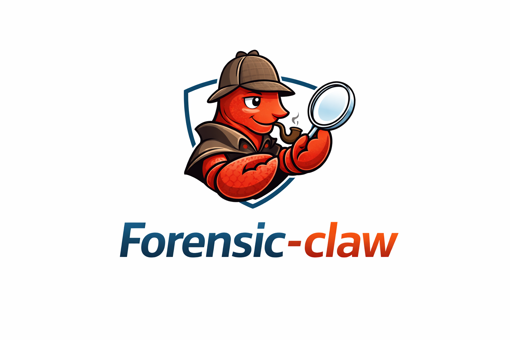

# Forensic-Claw

<div align="center">
  
</div>

로컬 LLM 기반 에이전트 프레임워크이자 Native Windows 지향 포렌식 워크벤치의 기반 저장소입니다. 현재 이 저장소는 `discord`, `kakaotalk`, `webui` 채널과 `vllm`, `custom` provider를 중심으로 정리되어 있으며, WebUI 채팅/세션/읽기 API와 Windows 런타임 baseline까지 포함합니다.

## 기획 배경

디지털 포렌식 분야에는 이미 `Axiom`, `Autopsy` 등 강력한 분석 도구들이 존재합니다. 다만 이러한 도구들은 증거를 수집하고 분류하며 개별 아티팩트를 확인하는 데 매우 유용한 반면, 실제 수사관처럼 사건의 맥락을 따라가며 여러 증거를 서로 연결하고, 그 연결 근거를 설명 가능한 형태로 정리하는 과정은 여전히 많은 부분이 사람의 수작업에 의존합니다.

특히 "어떤 행위가 왜 의심스러운지", "서로 다른 로그, 파일, 대화, 메타데이터가 어떻게 하나의 서사로 이어지는지", "그 판단이 어떤 증거와 출처에 기반하는지"를 일관된 흐름으로 정리해 법정 제출 수준의 보고서로 만드는 작업은 자동화가 충분히 정착되지 않았다고 보았습니다. 이 프로젝트는 바로 그 간극을 줄이기 위해 시작되었습니다.

Forensic-Claw의 목표는 기존 포렌식 도구를 대체하는 것이 아니라, 그 결과물을 바탕으로 증거 간 연관성을 추적하고, 분석 논리를 구조화하며, 출처와 근거를 따라가며 검토할 수 있는 보조 레이어를 만드는 것입니다. 다시 말해, "분석 도구"를 넘어 "설명 가능한 수사 보조 에이전트"에 가까운 워크플로우를 지향합니다.

## 현재 지원 범위

### 채널

- `discord`
- `kakaotalk`
- `webui`

### 프로바이더

- `vllm`
- `custom`

### 현재 구현된 핵심 기능

- agent loop
- context/session/memory
- tools
- bus
- cron
- heartbeat
- WebUI chat, session, streaming, shell trace, read-only case explorer
- channel plugin discovery via `forensic_claw.channels`
- Native Windows baseline and Windows CI

### 아직 남아 있는 핵심 범위

- `forensic_claw/forensics/` 도메인 계층
- Windows artifact native tools
- structured case write pipeline
- wiki/report 자동화

## 기준 문서

- [통합 개발 스펙](docs/MASTER_DEVELOPMENT_SPEC.md)

아래 문서들은 참조용 계획 문서이며, 현재 실행 기준은 `docs/MASTER_DEVELOPMENT_SPEC.md`입니다.

- [Native Windows Support Plan](docs/NATIVE_WINDOWS_SUPPORT_PLAN.md)
- [Local Web UI Forensic Workbench Plan](docs/LOCAL_WEB_UI_FORENSIC_WORKBENCH_PLAN.md)
- [개발 우선순위 로드맵](docs/DEVELOPMENT_PRIORITY_ROADMAP.md)
- [Karpathy 스타일 포렌식 위키 스킬](docs/KARPATHY_FORENSIC_WIKI_SKILL.md)
- [Windows Forensic Automation Plan](docs/WINDOWS_FORENSIC_AUTOMATION_PLAN.md)
- [Windows Artifact MCP Overview](docs/WINDOWS_ARTIFACT_MCP_OVERVIEW.md)
- [Windows Artifact Integration Strategy](docs/WINDOWS_ARTIFACT_INTEGRATION_STRATEGY.md)

## 개발 기준 명령

```bash
uv sync --all-extras
python -m pytest tests -q
ruff check forensic_claw tests
```

## Native Windows 설치 및 실행

아래 절차는 `Windows PowerShell` 기준입니다.

권장 환경:

- Windows 10/11
- Git
- Python `3.11+`
- 권장 interpreter: `64-bit Python`
- 추가 확인:
  - `x64 Windows + x64 Python` 실측 통과
  - `x64 Windows + x86 Python` 실측 통과

메모:

- 설치 후에는 `forensic-claw ...`와 `python -m forensic_claw ...` 둘 다 사용할 수 있습니다.
- Windows에서는 PATH 문제를 줄이기 위해 문서에서는 `python -m forensic_claw`를 기본 예시로 사용합니다.

### 1. 저장소 clone

```powershell
git clone https://github.com/dhsgud/Forensic-claw.git
cd Forensic-claw
```

### 2. 가상환경 생성

권장: 64-bit Python

```powershell
py -3.12 -m venv .venv
```

`x64 Windows + x86 Python`으로 확인하고 싶다면:

```powershell
py -3.12-32 -m venv .venv
```

가상환경 활성화:

```powershell
.\.venv\Scripts\Activate.ps1
```

PowerShell 실행 정책 때문에 활성화가 막히면 현재 세션에만 한정해서 아래를 먼저 실행합니다.

```powershell
Set-ExecutionPolicy -Scope Process -ExecutionPolicy Bypass
.\.venv\Scripts\Activate.ps1
```

그 다음 `pip`를 최신으로 올립니다.

```powershell
python -m pip install --upgrade pip
```

### 3. 패키지 설치

기본 설치:

```powershell
python -m pip install -e .
```

개발/테스트까지 같이 설치:

```powershell
python -m pip install -e ".[dev]"
```

더 정확한 토큰 추정을 위해 `tiktoken`까지 같이 설치:

```powershell
python -m pip install -e ".[tokens]"
```

개발/테스트 + optional token extras까지 한 번에 설치:

```powershell
python -m pip install -e ".[dev,tokens]"
```

메모:

- PowerShell에서는 extras 문법의 대괄호가 해석될 수 있으므로 `"..."`로 감싸는 편이 안전합니다.
- `tiktoken`은 이제 선택 설치입니다. 기본 설치만으로도 Native Windows 사용과 테스트가 가능합니다.

### 4. 설치 확인

먼저 CLI가 정상 로드되는지 확인합니다.

```powershell
python -m forensic_claw --help
```

### 5. 초기 설정 파일 생성

기본 설정 파일과 workspace를 생성합니다. 실제 터미널에서는 `onboard`를 실행하면
대화형 설정이 자동으로 열리고, 여기서 기본 model provider와 사용할 channels를
선택한 뒤 필요한 값을 바로 입력할 수 있습니다.

```powershell
python -m forensic_claw onboard
```

비대화형으로 기본 파일만 만들고 싶다면:

```powershell
python -m forensic_claw onboard --no-wizard
```

생성 경로:

```text
%USERPROFILE%\.forensic-claw\config.json
%USERPROFILE%\.forensic-claw\workspace\
```

설정 파일 예시:

```json
{
  "agents": {
    "defaults": {
      "workspace": "~/.forensic-claw/workspace",
      "model": "qwen1.5-35b-4bit",
      "provider": "vllm",
      "maxTokens": 8192,
      "contextWindowTokens": 65536,
      "temperature": 0.1
    }
  },
  "providers": {
    "vllm": {
      "apiBase": "http://localhost:8000/v1",
      "apiKey": ""
    },
    "custom": {
      "apiBase": "http://127.0.0.1:8080/v1",
      "apiKey": "",
      "extraHeaders": {}
    }
  }
}
```

### 6. 현재 상태 확인

설치와 초기 설정이 끝났으면 상태를 확인합니다.

```powershell
python -m forensic_claw status
```

정상이라면 아래 항목이 보여야 합니다.

- Config 경로
- Workspace 경로
- 현재 모델 이름

### 7. 프로바이더 설정

`agent`를 실제로 사용하려면 최소 하나의 프로바이더를 설정해야 합니다.

가장 흔한 두 가지는 아래입니다.

- `vllm`
- `custom` (`llama.cpp`, LM Studio, 기타 OpenAI-compatible endpoint)

아래 `프로바이더 설정` 섹션의 예시를 그대로 `config.json`에 반영하면 됩니다.

### 8. CLI에서 바로 사용

프로바이더 설정 후 interactive CLI를 시작합니다.

```powershell
python -m forensic_claw agent
```

메시지 한 번만 보내고 끝내고 싶다면:

```powershell
python -m forensic_claw agent -m "Hello"
```

### 9. 채널 게이트웨이 실행

Discord 또는 KakaoTalk 채널을 붙일 때는 gateway를 실행합니다.

```powershell
python -m forensic_claw gateway
```

### 10. Windows 동작 검증

Native Windows에서 설치가 잘 되었는지 빠르게 확인하려면 아래 정도를 먼저 실행하면 됩니다.

```powershell
python -m forensic_claw --help
python -m forensic_claw onboard
python -m forensic_claw status
```

개발 환경이라 전체 테스트까지 확인하고 싶다면:

```powershell
uv sync --all-extras
python -m pytest tests -q
ruff check forensic_claw tests
```

현재 정리 이후 기준 로컬 결과:

```text
452 passed
ruff check clean
```

## 빠른 시작 요약

PowerShell에서 최소 명령만 빠르게 따라가려면 아래 순서대로 실행하면 됩니다.

```powershell
git clone https://github.com/dhsgud/Forensic-claw.git
cd Forensic-claw
py -3.12 -m venv .venv
.\.venv\Scripts\Activate.ps1
python -m pip install --upgrade pip
python -m pip install -e .
python -m forensic_claw onboard
python -m forensic_claw status
python -m forensic_claw agent
```

## 프로바이더 설정

## vLLM

로컬 또는 원격 vLLM OpenAI-compatible 서버를 사용할 때 설정합니다.

```json
{
  "agents": {
    "defaults": {
      "provider": "vllm",
      "model": "qwen1.5-35b-4bit"
    }
  },
  "providers": {
    "vllm": {
      "apiBase": "http://localhost:8000/v1",
      "apiKey": ""
    }
  }
}
```

메모:

- `apiBase`를 비우면 기본값 `http://localhost:8000/v1`을 사용합니다.
- 로컬 서버가 API 키를 요구하지 않으면 `apiKey`는 빈 문자열이어도 됩니다.

## Custom

`llama.cpp`, LM Studio, 기타 OpenAI-compatible 서버를 직접 연결할 때 사용합니다.

```json
{
  "agents": {
    "defaults": {
      "provider": "custom",
      "model": "llama.cpp/local"
    }
  },
  "providers": {
    "custom": {
      "apiBase": "http://127.0.0.1:8080/v1",
      "apiKey": "",
      "extraHeaders": {
        "x-session-affinity": "sticky-session"
      }
    }
  }
}
```

메모:

- `model`은 그대로 upstream 서버로 전달됩니다.
- 필요하면 `extraHeaders`에 커스텀 헤더를 넣을 수 있습니다.

## Discord 채널 설정

### 준비 사항

1. Discord Developer Portal에서 봇 생성
2. Bot Token 발급
3. `MESSAGE CONTENT INTENT` 활성화
4. 본인 User ID 확인

### 설정 예시

```json
{
  "channels": {
    "discord": {
      "enabled": true,
      "token": "YOUR_BOT_TOKEN",
      "allowFrom": ["YOUR_USER_ID"],
      "groupPolicy": "mention"
    }
  }
}
```

### 동작 방식

- DM은 `allowFrom` 허용 사용자에 대해 응답
- 서버 채널은 기본적으로 `@mention`일 때만 응답
- 긴 메시지는 Discord 제한에 맞춰 자동 분할
- 첨부 파일 다운로드/전송 지원

## KakaoTalk 채널 설정

이 저장소의 카카오톡 채널은 `카카오 i 오픈빌더 스킬 서버(webhook) + callback API` 방식으로 구현되어 있습니다.

### 준비 사항

1. 카카오 i 오픈빌더에서 스킬 서버 URL 등록
2. callback 기능 사용 가능한 환경 준비
3. 외부에서 접근 가능한 webhook URL 준비

### 설정 예시

```json
{
  "channels": {
    "kakaotalk": {
      "enabled": true,
      "host": "127.0.0.1",
      "port": 3000,
      "skillPath": "/skill",
      "healthPath": "/health",
      "allowFrom": ["*"],
      "pairingCode": "CHANGE_ME",
      "adminKakaoId": "",
      "callbackTimeout": 55,
      "pendingText": "분석 중입니다. 잠시만 기다려 주세요."
    }
  }
}
```

### 동작 방식

- `POST /skill`로 카카오 요청 수신
- 즉시 `useCallback: true` 응답 반환
- 실제 모델 응답은 `callbackUrl`로 전송
- `/pair [코드] [이름]` 명령으로 사용자 연결 가능
- 페어링 정보는 런타임 디렉터리의 `kakaotalk/pairs.json`에 저장
- 일반 텍스트는 `simpleText` 기준으로 자동 분할
- JSON 문자열을 `basicCard` 또는 `outputs` 템플릿으로 응답 가능

메모:

- 기본값은 `127.0.0.1`입니다.
- 외부 reverse proxy 또는 별도 ingress 없이 직접 바인딩해야 할 때만 `0.0.0.0`으로 바꾸는 것을 권장합니다.

### 헬스체크

```text
GET /health
```

응답 예시:

```json
{
  "ok": true,
  "channel": "kakaotalk"
}
```

## 최소 설정 예시

### Discord + vLLM

```json
{
  "agents": {
    "defaults": {
      "model": "qwen1.5-35b-4bit",
      "provider": "vllm"
    }
  },
  "providers": {
    "vllm": {
      "apiBase": "http://localhost:8000/v1"
    }
  },
  "channels": {
    "discord": {
      "enabled": true,
      "token": "YOUR_BOT_TOKEN",
      "allowFrom": ["YOUR_USER_ID"],
      "groupPolicy": "mention"
    }
  }
}
```

### KakaoTalk + llama.cpp

```json
{
  "agents": {
    "defaults": {
      "model": "llama.cpp/local",
      "provider": "custom"
    }
  },
  "providers": {
    "custom": {
      "apiBase": "http://127.0.0.1:8080/v1"
    }
  },
  "channels": {
    "kakaotalk": {
      "enabled": true,
      "host": "127.0.0.1",
      "port": 3000,
      "allowFrom": ["*"],
      "pairingCode": "CHANGE_ME"
    }
  }
}
```

## CLI 명령어

```bash
forensic-claw --help
forensic-claw onboard
forensic-claw gateway
forensic-claw agent
forensic-claw status
forensic-claw plugins list
forensic-claw channels status
forensic-claw channels login discord
forensic-claw channels login kakaotalk
```

메모:

- `provider login`은 현재 로컬 전용 빌드에서는 사용하지 않습니다.

## 저장소 상태와 범위

테스트 기준, 현재 프로젝트 구조, 이번 정리에서 제거된 범위, 운영 시 주의사항은 [docs/REPOSITORY_STATUS_AND_SCOPE.md](./docs/REPOSITORY_STATUS_AND_SCOPE.md)를 참고하세요.
