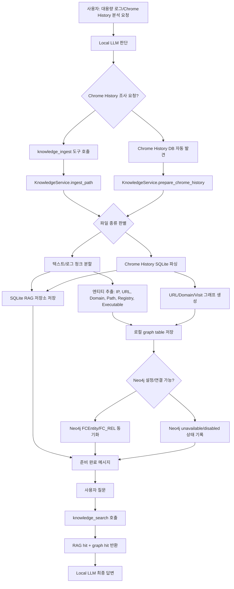

# RAG + Neo4j Knowledge System Report

## 목표

이 구현의 목표는 대용량 로그, Chrome 검색/방문 기록 DB, 증거 폴더 같은 큰 파일을 Local LLM이 직접 원문 전체로 읽지 않게 만드는 것이다.

대신 Local LLM은 먼저 `knowledge_ingest`를 호출해 증거를 전처리하고, 전처리된 결과를 로컬 RAG 저장소와 Neo4j 그래프에 넣는다. 사용자가 `/knowledge ingest`를 직접 입력할 수도 있지만, Chrome DB, 검색기록, 방문기록 조사가 필요하다고 판단되는 일반 대화 요청에서는 `AgentLoop`가 먼저 Chrome `History` DB를 자동 발견하고 전처리한다. 준비가 끝나면 사용자에게 “준비되었다. 이제 질문하면 된다.”는 식으로 알려주고, 이후 질문에는 `knowledge_search`를 먼저 호출해 RAG 청크와 그래프 엔티티를 근거로 답변한다.

## 전체 흐름



## 주요 구성 파일

| 영역 | 파일 | 역할 |
|---|---|---|
| 설정 | `forensic_claw/config/schema.py` | `KnowledgeConfig`, `Neo4jConfig` 추가 |
| 에이전트 연결 | `forensic_claw/agent/loop.py` | `KnowledgeService` 생성 및 지식 도구 등록 |
| 프롬프트 정책 | `forensic_claw/agent/context.py` | 대용량 증거는 먼저 `knowledge_ingest`, 질의 전 `knowledge_search` 사용하도록 안내 |
| 도구 | `forensic_claw/agent/tools/knowledge.py` | `knowledge_ingest`, `knowledge_search`, `knowledge_status` 구현 |
| 서비스 | `forensic_claw/knowledge/service.py` | 파일 판별, 전처리, 청크화, Chrome History 파싱, 엔티티 추출 |
| 로컬 저장소 | `forensic_claw/knowledge/store.py` | SQLite RAG/FTS/graph 저장 |
| Neo4j 연동 | `forensic_claw/knowledge/neo4j_sink.py` | Neo4j optional sync |
| 명령어 | `forensic_claw/command/builtin.py` | `/knowledge status`, `/knowledge ingest`, `/knowledge search` 추가 |
| 의존성 | `pyproject.toml` | `neo4j` Python driver 추가 |
| 테스트 | `tests/knowledge/test_knowledge_service.py` | 텍스트 로그/Chrome History 인덱싱 동작 검증 |
| 테스트 | `tests/tools/test_knowledge_tools.py` | 에이전트 도구 동작 검증 |

## 런타임 구조

`AgentLoop`가 시작될 때 실제 `Path` workspace가 있으면 `KnowledgeService`를 생성한다.

```text
AgentLoop
  ├─ KnowledgeService
  │   ├─ KnowledgeStore
  │   │   └─ workspace/knowledge/rag.sqlite
  │   └─ Neo4jSink
  └─ ToolRegistry
      ├─ knowledge_ingest
      ├─ knowledge_search
      └─ knowledge_status
```

테스트용 `MagicMock` workspace처럼 실제 경로가 아닌 경우에는 지식 저장소를 만들지 않는다. 기존 테스트와 경량 루프 생성 흐름을 깨지 않기 위한 방어 처리다.

## 저장 구조

로컬 RAG 저장소는 `workspace/knowledge/rag.sqlite`에 생성된다.

SQLite 테이블:

| 테이블 | 목적 |
|---|---|
| `documents` | 원본 파일 단위 메타데이터 저장 |
| `chunks` | RAG 검색용 텍스트 청크 저장 |
| `chunks_fts` | SQLite FTS5 전문 검색 인덱스 |
| `entities` | 그래프 노드 저장 |
| `relationships` | 그래프 관계 저장 |

문서 메타데이터에는 원본 경로, 파일 종류, SHA-256, 크기, case name, investigator name 등이 들어간다.

## 지원하는 입력

현재 구현된 기본 입력:

- `.log`
- `.txt`
- `.csv`
- `.json`
- `.jsonl`
- `.ndjson`
- Chrome `History`
- `History.sqlite`
- `.sqlite`
- `.sqlite3`
- `.db`

디렉터리를 넣으면 기본적으로 재귀 탐색한다. 단, `.git`, `.venv`, `node_modules`, `__pycache__`, `.ruff_cache`, `.pytest_cache` 등은 건너뛴다.

## 텍스트/로그 전처리

텍스트 파일은 인코딩을 감지한 뒤 청크로 나눈다.

기본값:

- `chunk_chars`: `6000`
- `chunk_overlap_chars`: `400`
- `max_file_bytes`: `256MB`

각 청크에는 line range와 encoding 메타데이터가 붙는다. 검색은 SQLite FTS5를 우선 사용하고, FTS query가 실패하면 `LIKE` fallback을 사용한다.

## Chrome History 전처리

Chrome History DB는 원본을 직접 열지 않고 임시 복사본을 만든 뒤 SQLite로 읽는다. 브라우저가 DB 파일을 잡고 있어도 최대한 안전하게 분석하기 위한 방식이다.

읽는 테이블:

- `urls`
- `visits`

추출하는 내용:

- URL
- title
- visit count
- observed visits
- latest visit UTC
- domain

각 방문 URL은 RAG 청크로 들어가고, 그래프에는 `Source -> URL -> Domain` 흐름으로 저장된다.

## 그래프 모델

로컬 그래프는 SQLite에도 저장되고, Neo4j가 가능하면 같은 데이터를 Neo4j로 동기화한다.

대표 노드 종류:

- `Source`
- `Case`
- `Investigator`
- `IP`
- `URL`
- `Domain`
- `FilePath`
- `RegistryKey`
- `Executable`

대표 관계:

- `HAS_SOURCE`
- `INGESTED`
- `MENTIONS`
- `VISITED_URL`
- `HAS_DOMAIN`

Neo4j에는 다음 형태로 들어간다.

```cypher
(:FCEntity {id, kind, value, metadata})
(:FCEntity)-[:FC_REL {id, type, document_id, metadata}]->(:FCEntity)
```

관계 type은 `FC_REL.type` 속성으로 저장한다. Neo4j relationship label을 동적으로 늘리지 않고 하나의 label을 쓰는 이유는 입력 데이터 종류가 늘어나도 스키마를 안정적으로 유지하기 위해서다.

## Neo4j 설정

기본 설정:

```yaml
knowledge:
  enabled: true
  storeDir: knowledge
  chunkChars: 6000
  chunkOverlapChars: 400
  maxFileBytes: 268435456
  maxChromeRows: 10000
  neo4j:
    enabled: true
    uri: bolt://127.0.0.1:7687
    username: neo4j
    password: ""
    database: neo4j
```

환경 변수 override:

```powershell
$env:FORENSIC_CLAW_NEO4J_URI = "bolt://127.0.0.1:7687"
$env:FORENSIC_CLAW_NEO4J_USERNAME = "neo4j"
$env:FORENSIC_CLAW_NEO4J_PASSWORD = "password"
$env:FORENSIC_CLAW_NEO4J_DATABASE = "neo4j"
```

Neo4j가 꺼져 있어도 RAG 인덱싱은 계속 작동한다. 이 경우 Neo4j 상태는 `unavailable`, `disabled`, 또는 `driver_missing`으로 표시된다. 연결 시도는 짧은 timeout을 둬서 WebUI나 에이전트가 오래 멈추지 않게 했다.

## 사용자 명령어

Chrome History 조사는 명령어 없이도 자동 준비된다.

예:

```text
크롬 DB 조사해줘
크롬 검색기록 분석해줘
브라우저 방문기록 확인해줘
```

상태 확인:

```text
/knowledge status
```

증거 준비:

```text
/knowledge ingest C:\Cases\Case-001\Evidence
```

검색:

```text
/knowledge search powershell 10.0.0.5
```

Local LLM 도구 호출 방식:

```text
knowledge_ingest(path="C:\Cases\Case-001\Evidence")
knowledge_search(query="suspicious domain")
knowledge_status()
```

## 기대 사용자 경험

1. 사용자가 “이 폴더/로그/Chrome History 분석 준비해줘”라고 요청한다.
2. Local LLM이 `knowledge_ingest`를 호출한다.
3. 시스템이 파일을 스캔하고 RAG/그래프에 넣는다.
4. 준비되면 다음 메시지를 반환한다.

```text
Knowledge ingest ready.
- scannedFiles: ...
- ingestedFiles: ...
- chunks: ...
- graphEntities: ...
- graphRelationships: ...
Ready: ask questions now; use knowledge_search before answering.
```

5. 사용자가 질문하면 Local LLM이 `knowledge_search`를 먼저 호출한다.
6. RAG 청크와 그래프 엔티티를 근거로 답한다.

## 검증 결과

구현 후 검증:

```text
ruff check forensic_claw tests
python -m pytest tests -q
```

결과:

```text
461 passed
```

추가 확인:

- WebUI 서버 재시작 완료
- `/health` 응답 정상
- `/api/bootstrap`에서 `/knowledge` 명령 노출 확인

## 현재 한계와 다음 단계

현재 RAG 검색은 SQLite FTS 기반 키워드 검색이다. 의미 기반 벡터 검색은 아직 붙이지 않았다. 다음 단계에서 로컬 embedding 모델 또는 OpenAI-compatible embedding endpoint를 붙이면 hybrid search 구조로 확장할 수 있다.

추천 다음 작업:

- Local embedding provider 설정 추가
- `chunks.embedding` 또는 별도 vector index 추가
- Neo4j에서 timeline/query helper 추가
- WebUI에 “증거 준비” 패널 추가
- ingest progress event를 WebSocket으로 표시
- EVTX 전용 parser 추가
- Chrome History 외 Cookies, Downloads, Login Data, Cache index 지원
